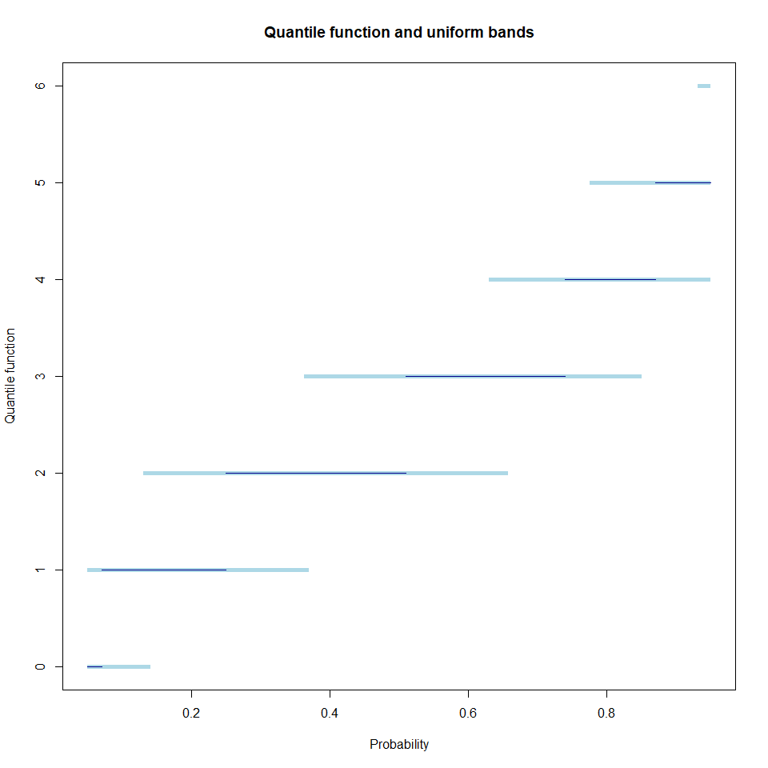
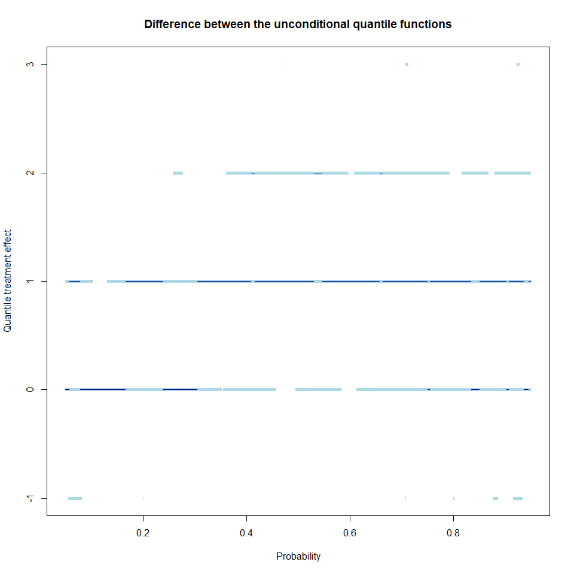
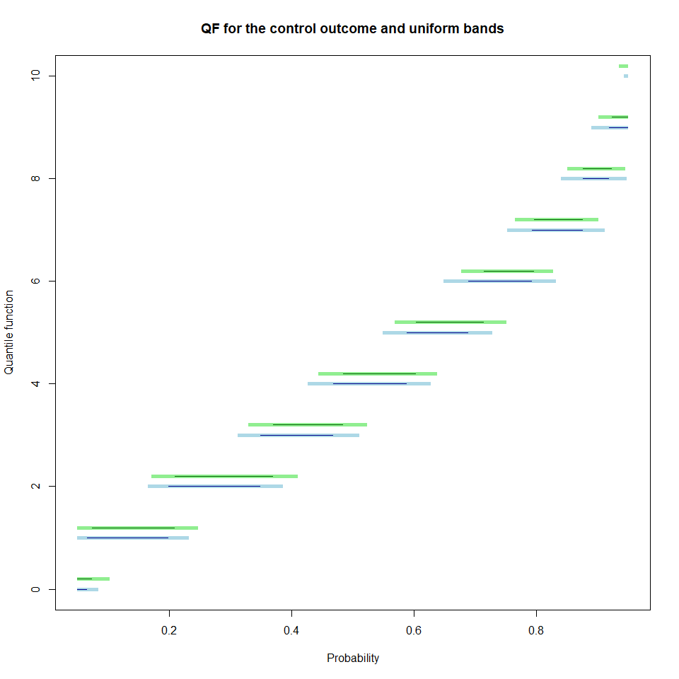

<!-- README.md is generated from README.Rmd. Please edit that file -->
The discreteQ repository
========================

This repository contains two different parts:

1.  In the folder repository you can find the datasets and the R codes that generated all the results in the paper in the paper "Generic Inference on Quantile and Quantile Effect Functions for Discrete Outcomes" written by Victor Chernozhukov, Ivan Fernandez-Val, Blaise Melly and Kaspar Wuethrich. This paper is available at <https://arxiv.org/abs/1608.05142>. The first empirical example uses data from the Oregon health experiment. The data are available at <http://www.nber.org/oregon/4.data.html>. The second empirical example is a decomposition of the black-white testscore gap. The data are available at dx.doi.org/10.1257/aer.103.2.981. The codes that produce the simulations results in Apendix C are also provided.

2.  The R package that contain generic functions that allows researchers to easily apply the methods suggested in the paper "Generic Inference on Quantile and Quantile Effect Functions for Discrete Outcomes" written by V. Chernozhukov, I. Fernandez-Val, B. Melly, and K. Wuethrich. This paper is available at <https://arxiv.org/abs/1608.05142>. The goal of discreteQ is to perform inference on quantile functions, quantile treatment effect functions and decompositions of differences between quantile functions for possibly discrete outcomes.

Installation of the discreteQ package
=====================================

You can install the released version of discreteQ from [CRAN](https://CRAN.R-project.org) with:

``` r
# You can get the discreteQ package from GitHub:
install.packages("devtools")
devtools::install_github("bmelly/discreteQ")
```

Examples with simulated data
============================

Example 1: confidence bands for single quantile functions
---------------------------------------------------------

discreteQ can be used in three different ways. First, the command can provide uniform bands for the unconditional quantile function of an outcome variable. Let's consider an artificial example with 100 observations drawn from the Poisson distribution with mean 3:

``` r
library(discreteQ)
set.seed(1234)
outcome <- rpois(100, 3)
results1 <- discreteQ(outcome)
```

The output of the function is a list of step functions:

``` r
results1
#> $Q
#> Step function
#> Call: stats::stepfun(F, c(ys, max(ys)), right = TRUE)
#>  x[1:8] =   0.07,   0.25,   0.51,  ...,   0.99,      1
#> 9 plateau levels =      0,      0,      1,  ...,      6,      8
#> 
#> $ub.Q
#> Step function
#> Call: stats::stepfun(lb.F.i, c(ys, max(ys)), right = FALSE)
#>  x[1:8] =      0, 0.12995, 0.36257,  ..., 0.97288,      1
#> 9 plateau levels =      0,      1,      2,  ...,      8,      8
#> 
#> $lb.Q
#> Step function
#> Call: stats::stepfun(ub.F.i, c(ys, max(ys)), right = TRUE)
#>  x[1:8] = 0.14082, 0.37005, 0.65743,  ...,      1,      1
#> 9 plateau levels =      0,      0,      1,  ...,      6,      8
#> 
#> $F
#> Step function
#> Call: stats::stepfun(ys, c(0, F))
#>  x[1:8] =      0,      1,      2,  ...,      6,      8
#> 9 plateau levels =      0,   0.07,   0.25,  ...,   0.99,      1
#> 
#> $lb.F
#> Step function
#> Call: stats::stepfun(ys, c(0, lb.F.i))
#>  x[1:8] =      0,      1,      2,  ...,      6,      8
#> 9 plateau levels =      0,      0, 0.12995,  ..., 0.97288,      1
#> 
#> $ub.F
#> Step function
#> Call: stats::stepfun(ys, c(0, ub.F.i))
#>  x[1:8] =      0,      1,      2,  ...,      6,      8
#> 9 plateau levels =      0, 0.14082, 0.37005,  ...,      1,      1
#> 
#> $q.range
#> [1] 0.05 0.95
#> 
#> $ys
#> [1] 0 1 2 3 4 5 6 8
#> 
#> $bsrep
#> [1] 200
#> 
#> $model
#> [1] "univariate"
#> 
#> $method
#> [1] "empirical"
#> 
#> attr(,"class")
#> [1] "discreteQ"
```

We recommend using the plot function to display the results:

``` r
plot(results1)
```



The point estimates are shown in dark blue and the uniform bands in light blue. It is also possible to obtain a tabular summary of the results using summary:

``` r
summary(results1)
#>       quantile QF lower bound upper bound
#>  [1,]     0.05  0           0           1
#>  [2,]     0.10  1           0           1
#>  [3,]     0.15  1           1           2
#>  [4,]     0.20  1           1           2
#>  [5,]     0.25  1           1           2
#>  [6,]     0.30  2           1           2
#>  [7,]     0.35  2           1           2
#>  [8,]     0.40  2           2           3
#>  [9,]     0.45  2           2           3
#> [10,]     0.50  2           2           3
#> [11,]     0.55  3           2           3
#> [12,]     0.60  3           2           3
#> [13,]     0.65  3           2           4
#> [14,]     0.70  3           3           4
#> [15,]     0.75  4           3           4
#> [16,]     0.80  4           3           5
#> [17,]     0.85  4           3           5
#> [18,]     0.90  5           4           5
#> [19,]     0.95  5           4           6
```

By default the increment between quantile indexes is 0.05 but this can be modified.

Example 2: confidence bands for quantile treatment effect functions
-------------------------------------------------------------------

If a treatment variable is provided in the argument d but the argument decomposition is set to FALSE, then the discreteQ provides uniform bands that cover jointly the quantile functions of the treated and control outcomes and the quantile treatment effect functions.

If regressors are provided in the argument x, then the conditional distribution function of the outcome given the covariates is estimated separately in the control and treated group using distribution regression. In a second step, discreteQ estimates the counterfactual distributions that we would observe if all observations were not treated or treated by integrating the estimated conditional distributions over the distribution of the regressors in the whole sample. The estimated quantile treatment effect function has a causal interpretation if the treatment is randomized conditionally on the control variable (or can be treated as if it were).

Let's consider a second artifical example:

``` r
set.seed(1234)
treatment <- c(rep(0,1000), rep(1,1000))
reg <- rbinom(2000, 1, 0.4+treatment*0.2)
outcome <- rpois(2000, lambda = 2+4*reg)
```

We have generated 1000 control observations and 1000 treated observations. The binary regressor reg has a higher mean in treated group, which implies that the outcome has also a higher mean in the treated group. In fact, we see that the unconditional distribution of the outcome in the treated group is stochastically dominated by the unconditional distribution of the outcome in the control group:

``` r
results2 <- discreteQ(outcome, treatment)
plot(results2, main="Difference between the unconditional quantile functions")
```

 We see that the quantile tdifferences are uniformly weakly positive. In addition, the uniform bands exclude 0 at many quantile indexes. Since these are uniform bands that cover the whole functions with probability 1-alpha (which is 0.95 by default), we can reject the null hypothesis that treated and control unconditional distribution are identical.

However, given the regressors, there are no difference between the control and treated outcomes. The difference between the unconditional quantile functions should, therefore, not be interpreted as a causal effect of the treatment. This is why we now estimate the quantile treatment effect by including the regressors in the estimation:

``` r
results3 <- discreteQ(outcome, treatment, cbind(1, reg))
plot(results3)
```

 The bands include now 0 at all quantile indexes such that we can no longer reject the null hypothesis that the treatment has no effect at all.

The plot function can also be used to visualize the estimated counterfactual distributions that we would observed if nobody was treated (Q0) and that we would observe if everybody was treated (Q1):

``` r
plot(results3, which="Q0")
plot(results3, which="Q1", add=TRUE, shift=0.2, col.l="dark green", col.b="light green")
```

 With the argument add=TRUE it is possible to add the results for the function Q1. With the argument shift it is possible to shift the bands to avoid that they overlap.

Example 3: confidence bands for decompositions of observed differences
----------------------------------------------------------------------

Finally, discreteQ can be used to decompose the difference between the observed quantile function of the outcome for the treated group and the observed quantile function of the outcome for the control group. In order to perform this decomposition discreteQ estimates the counterfactual distribution that would prevail for control observations had they had the distribution of regressors of treated observations. In other words, we integrate the conditional distribution of the control outcome given the regressors over the unconditional distribution of the regressors for the treated observations. Distribution regression is used to estimated the conditional distribution and the link function can be specified with the argument method.

We can illustrate this third type of applications with the same data. We simply add the argument decomposition=TRUE when we call discreteQ:

``` r
results4 <- discreteQ(outcome, treatment, cbind(1, reg), decomposition=TRUE)
plot(results4)
```

 By default, plot show all quantile functions in the first panel and the three elements of the decomposition in the remaining panels. Note that the uniform bands cover simultaneously all the functions that appear in the four panels.

In the top-left panel we see both observed unconditional quantile functions as well as the counterfactual quantile function. The top-right panel provides the results for the difference between the observed unconditional distribution (Q1 minus Q0). This difference is decomposed into two components that appears in the bottom panels.

The bottom-left panel provides the difference between the counterfactual and the control quantile functions (Qc minus Q0). These two quantile functions are obtain by integrating the same conditional distribution of the outcome over different distribution of the covariates (for Qc we use the distribution of the regressors in the treatment group and for Q0 we use the distribution of the covariates for the control group). This difference is known under a variety of names in the literature: the composition effect, the explained component, the justified component, the effect of characteristics.

The bottom-right panel provides the results for the difference between the treated and the counterfactual quantile functions (Q1 minus Qc). These two quantile functions are obtained by integrating different conditional distribution function over the same distribution of the regressors. Thus, this part of the difference cannot be explained by the different characteristics of the groups. It is therefore called the unexplained difference. In discrimination studies, this component is often interpreted as the discrimination between the group (because it cannot be explained but this interpretation may be incorrect if important regressors are omitted or not observable). If we can assume that the treatment is as good as conditionally randomized, then this component has a causal interpretation as the quantile treatment effect on the treated. Thus, in this case, discreteQ can be used to estimate the quantile treatment effects for the whole population with the argument decomposition=FALSE and it can be used to estimate the quantile treatment effects on the treated with the argument decomposition=TRUE.

Concluding remarks
==================

The specificty of discreteQ is that it can deal with discrete and mixed continuous-discrete outcomes. For continuous outcomes we recommend to use the package Counterfactual that can be installed from CRAN.

For the precise definition of the estimators and their statistical properties.You are invited to read the paper "Generic Inference on Quantile and Quantile Effect Functions for Discrete Outcomes" written by Victor Chernozhukov, Ivan Fernandez-Val, Blaise Melly, and Kaspar Wuethrich. This paper is available at <https://arxiv.org/abs/1608.05142>.
